# KGWE Architecture

This document provides a comprehensive overview of the Kubernetes GPU Workload Enhancer (KGWE) architecture, including component interactions, data flows, and design decisions.

## Table of Contents

- [System Overview](#system-overview)
- [Component Architecture](#component-architecture)
- [Data Flow](#data-flow)
- [GPU Topology Model](#gpu-topology-model)
- [Scheduling Algorithm](#scheduling-algorithm)
- [MIG Management](#mig-management)
- [Deployment Architecture](#deployment-architecture)
- [Security Architecture](#security-architecture)

---

## System Overview

KGWE is a Kubernetes-native platform that optimizes GPU resource utilization through topology-aware scheduling, ML-based workload prediction, and intelligent GPU partitioning.

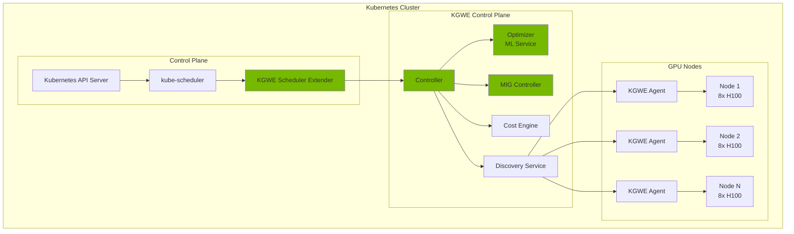

---

## Component Architecture

### Core Components

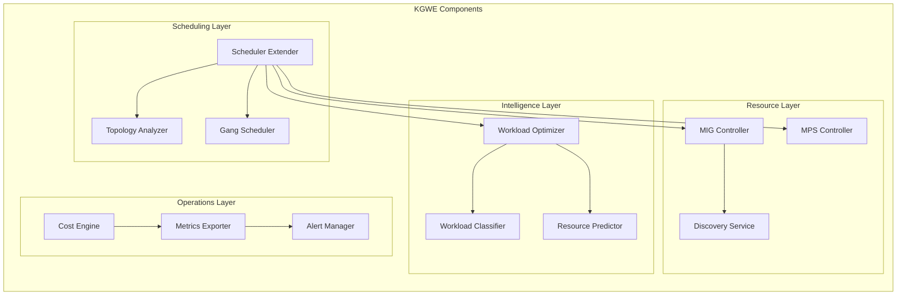

### Component Responsibilities

| Component | Responsibility | Technology |
|-----------|---------------|------------|
| **Scheduler Extender** | Intercepts scheduling decisions, applies GPU-aware scoring | Go |
| **Topology Analyzer** | Maps GPU interconnects (NVLink, PCIe, NUMA) | Go + NVML |
| **Workload Optimizer** | ML-based resource prediction | Python |
| **MIG Controller** | Manages MIG partition lifecycle | Go |
| **Cost Engine** | Tracks usage, manages budgets | Go |
| **Discovery Service** | Real-time GPU topology discovery | Go + NVML |
| **Metrics Exporter** | Prometheus metrics | Go |

---

## Data Flow

### Scheduling Flow

```mermaid
sequenceDiagram
    autonumber
    participant User
    participant API as K8s API
    participant Sched as kube-scheduler
    participant Ext as KGWE Extender
    participant Opt as Optimizer
    participant Disc as Discovery
    participant Agent as Node Agent

    User->>API: Create GPUWorkload CR
    API->>Sched: Pod pending
    Sched->>Ext: Filter & Score nodes

    Ext->>Disc: Get cluster topology
    Disc->>Agent: Query GPU status
    Agent-->>Disc: GPU topology + health
    Disc-->>Ext: Topology data

    Ext->>Opt: Get placement hint
    Opt-->>Ext: ML recommendation

    Ext-->>Sched: Scored nodes
    Sched->>API: Bind pod to node

    API->>Agent: Pod scheduled
    Agent->>Agent: Configure MIG/MPS
    Agent-->>API: Pod running
```

### Telemetry Flow

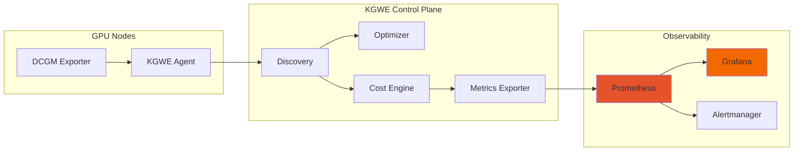

---

## GPU Topology Model

### Topology Hierarchy

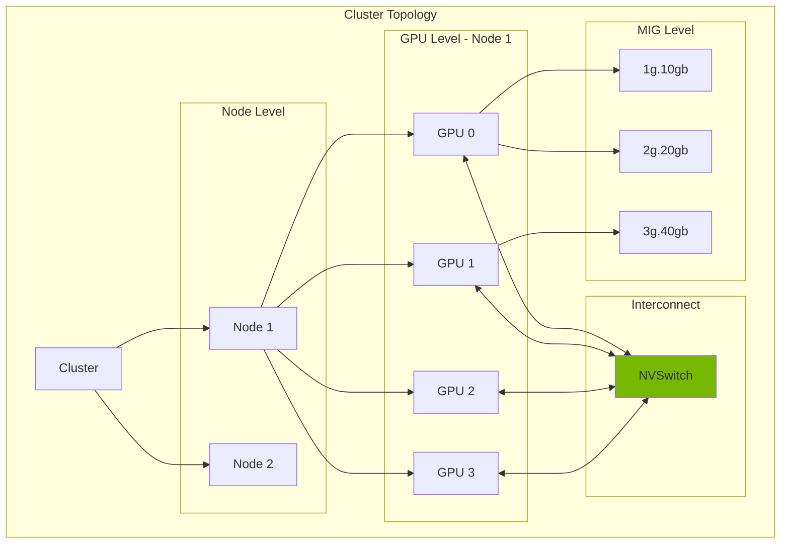

### NVLink Topology Matrix

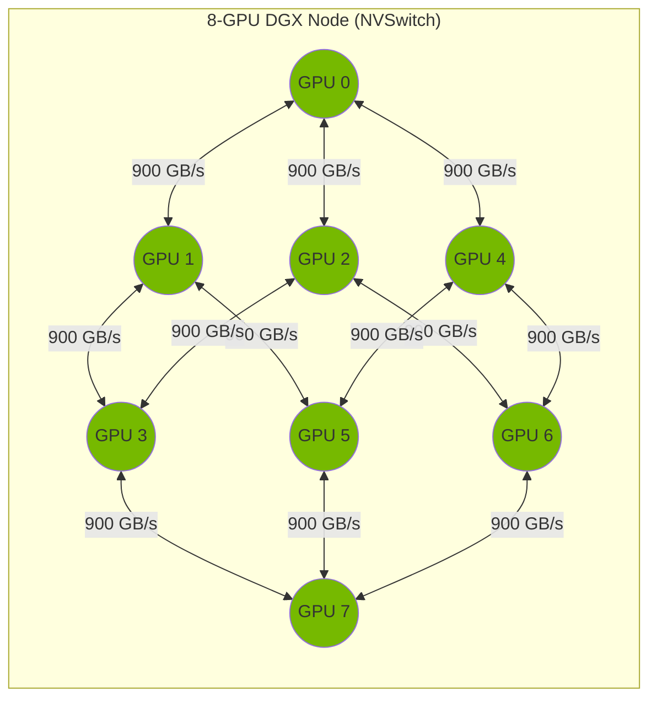

---

## Scheduling Algorithm

### Scoring Pipeline

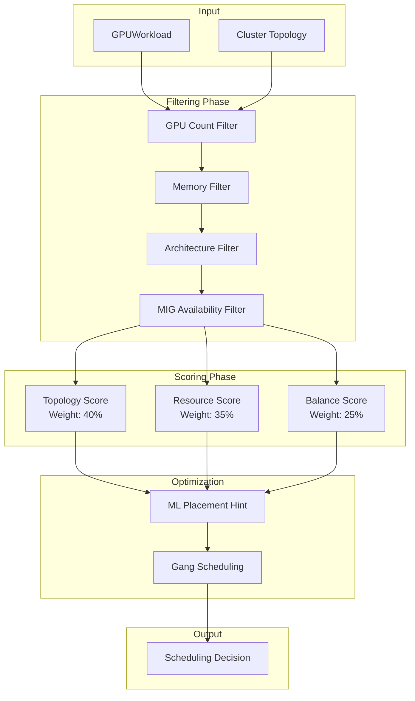

### Topology Scoring Algorithm

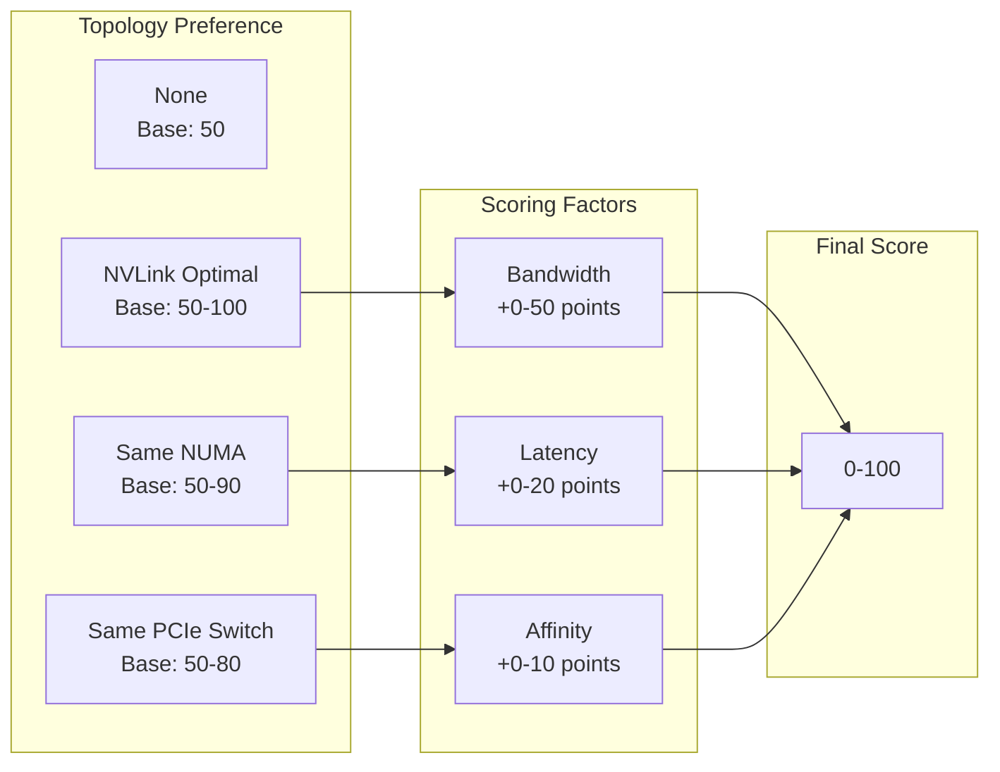

---

## MIG Management

### MIG Lifecycle

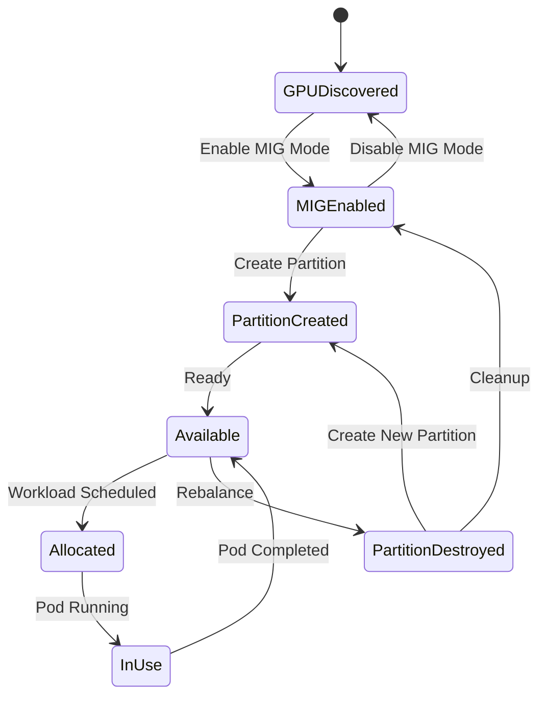

### MIG Profile Distribution

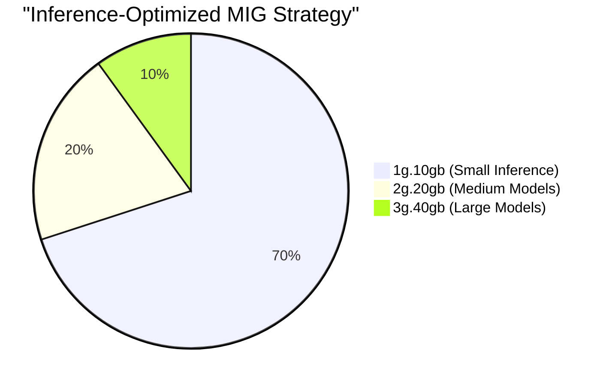

---

## Deployment Architecture

### Production Deployment

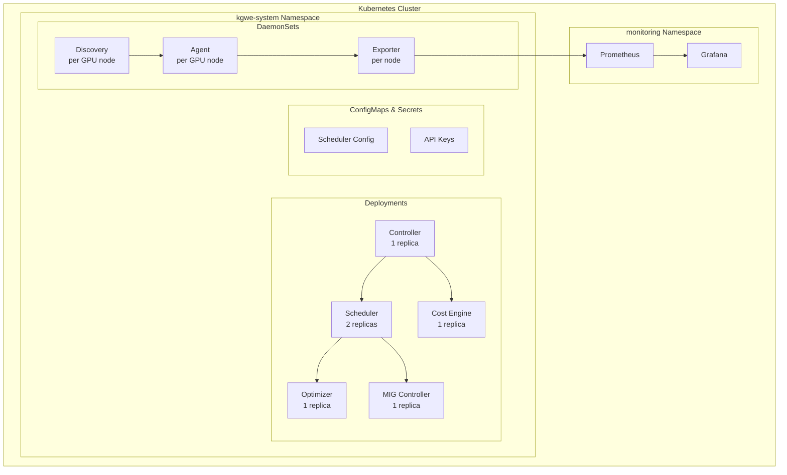

### High Availability

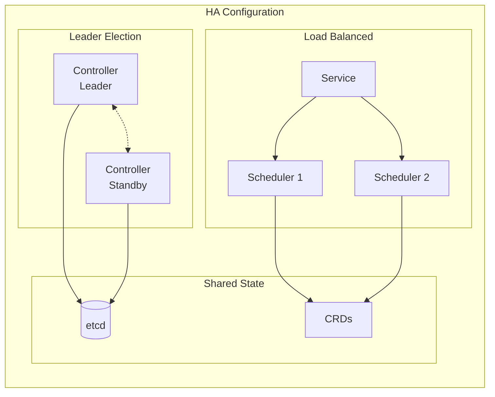

---

## Security Architecture

### RBAC Model

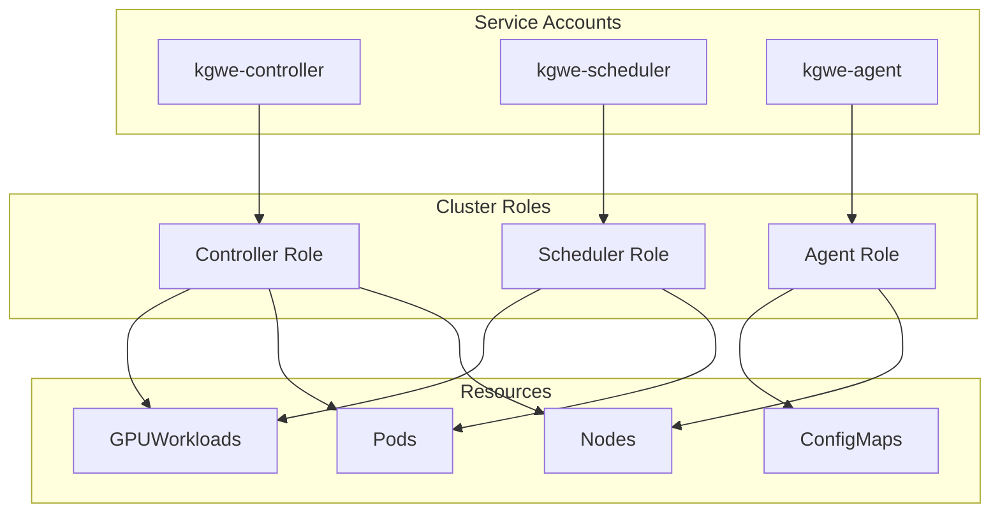

### Network Security

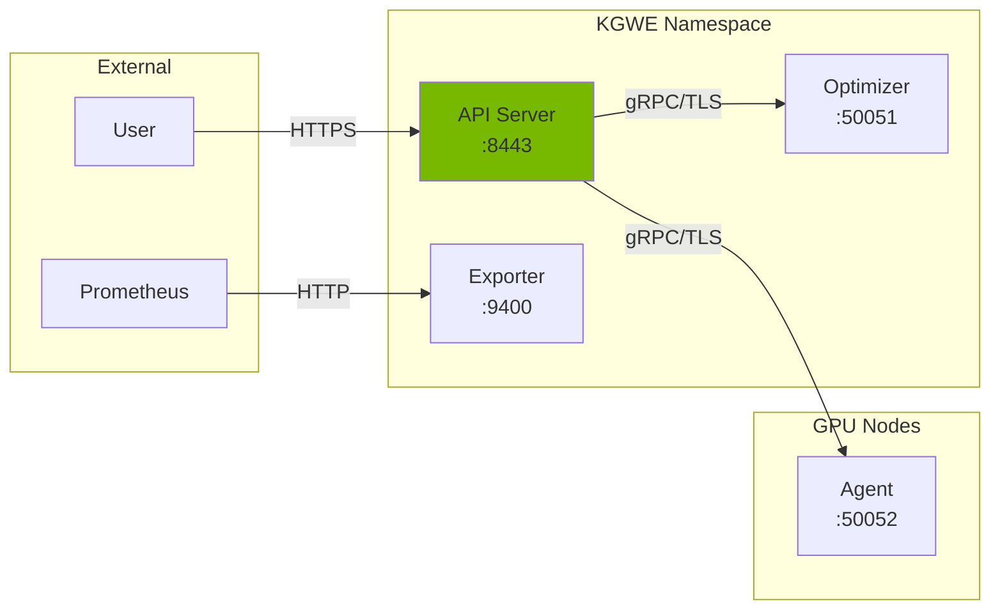

---

## Design Decisions

### Key Architectural Decisions

| Decision | Rationale | Trade-offs |
|----------|-----------|------------|
| **Scheduler Extender** | Extends default scheduler without replacement | Limited to scoring phase |
| **Python for ML** | Rich ML ecosystem (NumPy, scikit-learn) | Additional runtime dependency |
| **Go for core** | Performance, K8s native ecosystem | Steeper learning curve |
| **gRPC for IPC** | Performance, strong typing | More complex than REST |
| **CRDs for config** | Native K8s UX, validation | Learning curve for users |

### Performance Considerations

- **Caching**: Topology data cached with 30s TTL
- **Async operations**: MIG provisioning is non-blocking
- **Batch processing**: Telemetry aggregated before ML inference
- **Connection pooling**: gRPC channels reused

---

## Further Reading

- [PRD](PRD.md) - Product Requirements Document
- [API Reference](api-reference.md) - Custom Resource specifications
- [Operations Guide](operations.md) - Deployment and maintenance
